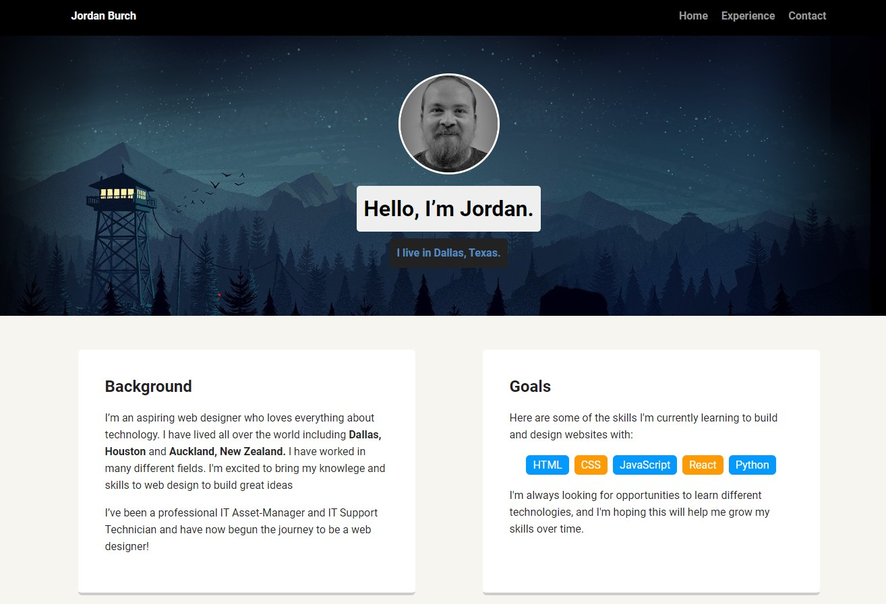

# Teachdegree-project 1
> A simple profile site to demonstrate the use of CSS and HTML.

## Table of contents
* [General info](#general-info)
* [Screenshots](#screenshots)
* [Technologies](#technologies)
* [Features](#features)
* [Contact](#contact)

## General info
My First ever project!, A simple portfolio project to demonstrate my CSS and HTML skills.

## Screenshots

## Technologies
* CSS3
* HTML5

## Features
List of features ready and TODOs for future development
* Hover effect over profile picture
* Basic flex layout
* Multiple page site

To-do list:
* Convert CSS to SASS
* Add hover animations to buttons and cards

## Contact
Created by [@JordanBurch101](https://github.com/Jordanburch101) - feel free to contact me!